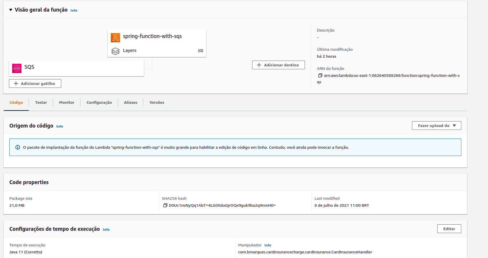
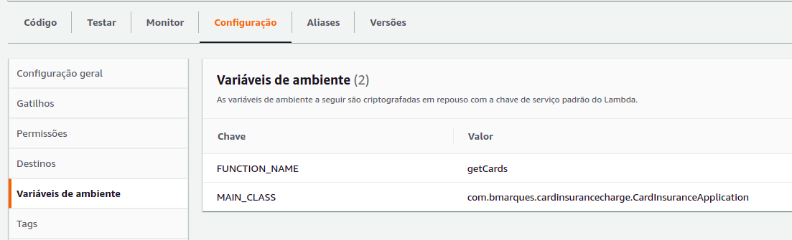

# Introduction
This example is to show how integrate AWS SQS with Lambda using Java with Spring Boot.
The sqs-producer folder contains a simple project in spring-boot with a endpoint to send a request, example:

´´´
curl --location --request POST 'localhost:8080/card-insurance/charged' \
--header 'Content-Type: application/json' \
--data-raw '{
    "maskedCardNumber": "6544-XXXX-XXXX-6446",
    "cardToken": "999",
    "productId": 1,
    "planId": "654",
    "logoId": "123",
    "userName": "Tiago",
    "attendingId": "987",
    "complementaryText": "SQS Teste"
}'
´´´

The lambda folder is the lambda project using spring-functions.


## How to configure and run sqs-producer application

### Required settings in lambda
It's necessary update the application-dev.properties with your access and secret key.
Add SQS URL too.

### How run the application by CLI
´´´
./gradlew bootRun --args='--spring.profiles.active=dev'
´´´

## How to configure lambda in AWS

### Update lambda via AWS CLI
```
aws lambda update-function-code --function-name spring-function-with-sqs --zip-file fileb://build/distributions/card-insurance-charge-0.0.1-SNAPSHOT.zip
```

### Required settings in lambda


