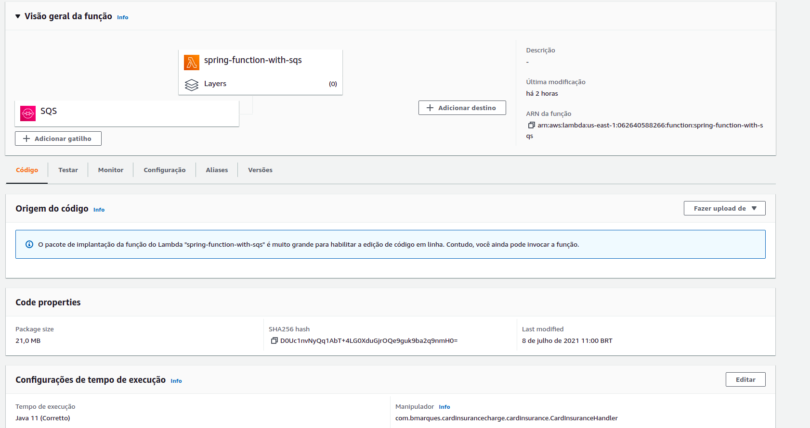
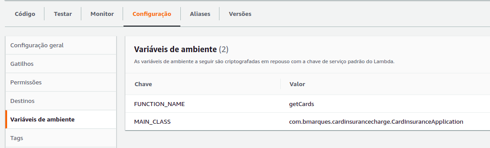

## Update lambda via AWS CLI
```
aws lambda update-function-code --function-name spring-function-with-sqs --zip-file fileb://build/distributions/card-insurance-charge-0.0.1-SNAPSHOT.zip
```

## Required settings in lambda

